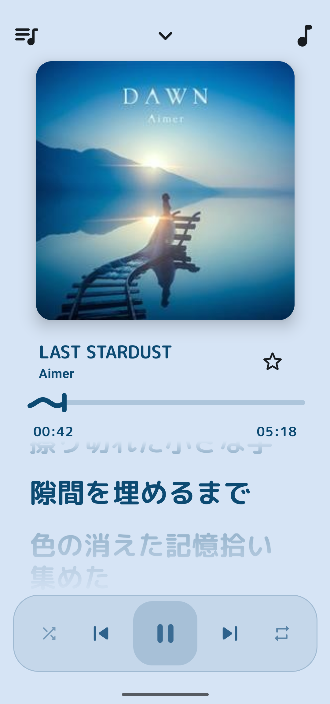
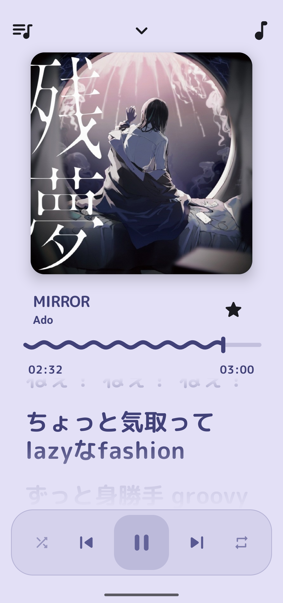
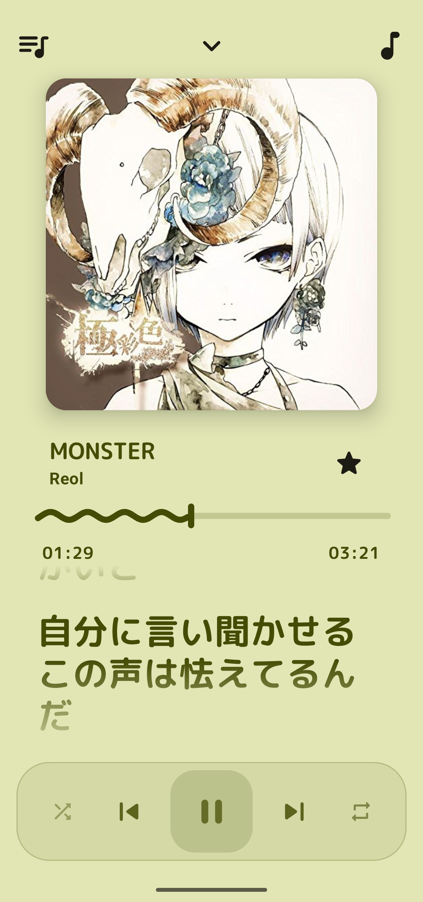
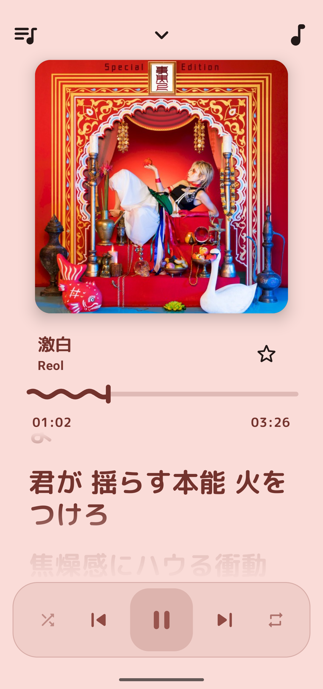

# UTA Player 🐗

  
  
  
  

**UTA Player** és un reproductor de música natiu per a Android centrat en la privadesa, l'alta fidelitat i una experiència d'usuari moderna. Desenvolupat per oferir una alternativa neta i eficient als serveis de streaming convencionals.

### ✨ Característiques Principals
* **Privadesa Total**: Sense registres ni comptes; tota la persistència de dades és 100% local.
* **Experiència sense Interrupcions**: Aplicació lliure de publicitat, telemetria i sistemes de seguiment.
* **Interfície Adaptativa**: Disseny basat en **Material 3** que reacciona dinàmicament als colors de la caràtula de l'àlbum.
* **Lletres Sincronitzades**: Cerca i importació automàtica de lletres (lyrics) mitjançant l'API de LrcLib.
* **Gestió Local**: Suport complet per a àlbums, artistes i creació de llistes de reproducció personalitzades.
---
*Projecte Final de DAM desenvolupat per Pol Busquets.*
